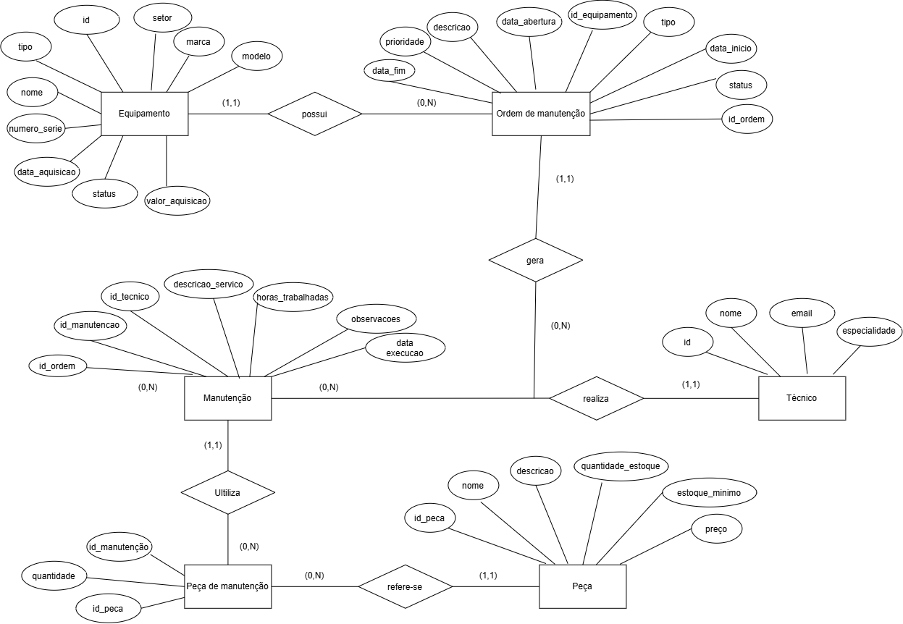
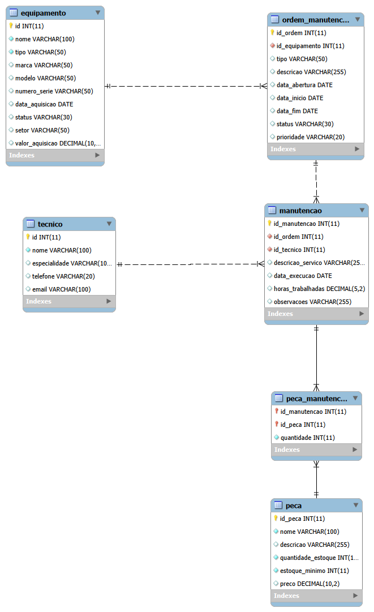

# Projeto: Manutenção de Equipamentos

Sistema de banco de dados desenvolvido para gerenciar equipamentos de uma fábrica, ordens de manutenção, técnicos responsáveis, manutenções realizadas e peças utilizadas.

## MER/DER Conceitual



## DER Lógico



## Dicionário de Dados

Entidade | Atributo | Tipo | Tamanho | Descrição
--- | --- | --- | --- | ---
Equipamento | id | Inteiro | 11 | Identificador, PK, Auto incrementável
Equipamento | nome | Texto | 100 | Nome do equipamento
Equipamento | tipo | Texto | 50 | Tipo do equipamento
Equipamento | marca | Texto | 50 | Marca do equipamento
Equipamento | modelo | Texto | 50 | Modelo do equipamento
Equipamento | numero_serie | Texto | 50 | Número de série, valor único
Equipamento | data_aquisicao | Data | - | Data de aquisição do equipamento
Equipamento | status | Texto | 30 | Status atual do equipamento
Equipamento | setor | Texto | 50 | Setor onde o equipamento está localizado
Equipamento | valor_aquisicao | Decimal | 10,2 | Valor de aquisição do equipamento
Técnico | id | Inteiro | 11 | Identificador, PK, Auto incrementável
Técnico | nome | Texto | 100 | Nome do técnico
Técnico | especialidade | Texto | 100 | Especialidade do técnico
Técnico | telefone | Texto | 20 | Telefone do técnico
Técnico | email | Texto | 100 | E-mail do técnico
Peça | id_peca | Inteiro | 11 | Identificador da peça, PK, Auto incrementável
Peça | nome | Texto | 100 | Nome da peça
Peça | descricao | Texto | 255 | Descrição da peça
Peça | quantidade_estoque | Inteiro | 11 | Quantidade disponível em estoque
Peça | estoque_minimo | Inteiro | 11 | Quantidade mínima em estoque
Peça | preco | Decimal | 10,2 | Preço da peça
Ordem Manutenção | id_ordem | Inteiro | 11 | Identificador da ordem, PK, Auto incrementável
Ordem Manutenção | id_equipamento | Inteiro | 11 | Identificador do equipamento, FK referenciando Equipamento (id)
Ordem Manutenção | tipo | Texto | 50 | Tipo da manutenção
Ordem Manutenção | descricao | Texto | 255 | Descrição da ordem
Ordem Manutenção | data_abertura | Data | - | Data de abertura da ordem
Ordem Manutenção | data_inicio | Data | - | Data de início
Ordem Manutenção | data_fim | Data | - | Data de finalização
Ordem Manutenção | status | Texto | 30 | Status da ordem
Ordem Manutenção | prioridade | Texto | 20 | Prioridade da manutenção
Manutenção | id_manutencao | Inteiro | 11 | Identificador da manutenção, PK, Auto incrementável
Manutenção | id_ordem | Inteiro | 11 | Identificador da ordem, FK
Manutenção | id_tecnico | Inteiro | 11 | Identificador do técnico, FK
Manutenção | descricao_servico | Texto | 255 | Descrição do serviço realizado
Manutenção | data_execucao | Data | - | Data de execução da manutenção
Manutenção | horas_trabalhadas | Decimal | 5,2 | Quantidade de horas trabalhadas
Manutenção | observacoes | Texto | 255 | Observações sobre o serviço
Peça Manutenção | id_manutencao | Inteiro | 11 | Identificador da manutenção, PK e FK
Peça Manutenção | id_peca | Inteiro | 11 | Identificador da peça, PK e FK
Peça Manutenção | quantidade | Inteiro | 11 | Quantidade da peça utilizada

## Dados de teste em CSV

* [equipamento.csv](equipamento.csv)
* [tecnico.csv](tecnico.csv)
* [peca.csv](peca.csv)
* [ordem_manutencao.csv](ordem_manutencao.csv)
* [manutencao.csv](manutencao.csv)
* [peca_manutencao.csv](peca_manutencao.csv)

## Script SQL DDL (Desenvolvimento: Criação do Banco de dados)

```sql
drop database if exists manutencao_equipamentos;
create database manutencao_equipamentos;
use manutencao_equipamentos;

create table equipamento(
    id int not null primary key auto_increment,
    nome varchar(100) not null,
    tipo varchar(50) not null,
    marca varchar(50),
    modelo varchar(50),
    numero_serie varchar(50) not null unique,
    data_aquisicao date,
    status varchar(30),
    setor varchar(50),
    valor_aquisicao decimal(10,2)
);

create table tecnico(
    id int not null primary key auto_increment,
    nome varchar(100) not null,
    especialidade varchar(100),
    telefone varchar(20),
    email varchar(100)
);

create table peca(
    id_peca int not null primary key auto_increment,
    nome varchar(100) not null,
    descricao varchar(255),
    quantidade_estoque int not null,
    estoque_minimo int not null,
    preco decimal(10,2)
);

create table ordem_manutencao(
    id_ordem int not null primary key auto_increment,
    id_equipamento int not null,
    tipo varchar(50),
    descricao varchar(255),
    data_abertura date,
    data_inicio date,
    data_fim date,
    status varchar(30),
    prioridade varchar(20)
);

create table manutencao(
    id_manutencao int not null primary key auto_increment,
    id_ordem int not null,
    id_tecnico int not null,
    descricao_servico varchar(255),
    data_execucao date,
    horas_trabalhadas decimal(5,2),
    observacoes varchar(255)
);

create table peca_manutencao(
    id_manutencao int not null,
    id_peca int not null,
    quantidade int not null,
    primary key (id_manutencao,id_peca)
);

alter table ordem_manutencao add constraint fk_equipamento foreign key (id_equipamento) references equipamento(id);
alter table manutencao add constraint fk_ordem foreign key (id_ordem) references ordem_manutencao(id_ordem);
alter table manutencao add constraint fk_tecnico foreign key (id_tecnico) references tecnico(id);
alter table peca_manutencao add constraint fk_manutencao foreign key (id_manutencao) references manutencao(id_manutencao);
alter table peca_manutencao add constraint fk_peca foreign key (id_peca) references peca(id_peca);

describe equipamento;
describe tecnico;
describe peca;
describe ordem_manutencao;
describe manutencao;
describe peca_manutencao;

show tables;
```

## Script SQL DML (Manipulação: População com dados de teste)

```sql
use manutencao_equipamentos;

insert into equipamento(nome,tipo,marca,modelo,numero_serie,data_aquisicao,status,setor,valor_aquisicao) values
("Torno CNC","Torno","Romi","Centur 30D","TR001","2022-03-15","Ativo","Usinagem",85000.00),
("Fresadora","Fresadora","Romi","D600","FR002","2021-08-10","Manutencao","Ferramentaria",72000.00),
("Compressor","Compressor de Ar","Schulz","CSV20","CP003","2023-01-20","Ativo","Producao",15000.00),
("Prensa Hidraulica","Prensa","Schuler","PH100","PH004","2020-06-12","Ativo","Estamparia",98000.00),
("Serra Fita","Serra","Starrett","SFM300","SF005","2024-02-05","Ativo","Corte",12500.00);

insert into tecnico(nome,especialidade,telefone,email) values
("Carlos Silva","Mecanica","19999990001","carlos@empresa.com"),
("Joao Santos","Eletrica","19999990002","joao@empresa.com"),
("Marcos Oliveira","Automacao","19999990003","marcos@empresa.com"),
("Ana Pereira","Mecatronica","19999990004","ana@empresa.com"),
("Lucas Costa","Hidraulica","19999990005","lucas@empresa.com");

insert into peca(nome,descricao,quantidade_estoque,estoque_minimo,preco) values
("Rolamento","Rolamento industrial",20,5,80.00),
("Correia","Correia de transmissao",15,4,45.00),
("Sensor","Sensor de proximidade",10,3,120.00),
("Filtro","Filtro de oleo industrial",12,4,65.00),
("Valvula","Valvula hidraulica",8,2,180.00);

insert into ordem_manutencao(id_equipamento,tipo,descricao,data_abertura,data_inicio,data_fim,status,prioridade) values
(1,"Preventiva","Revisao geral do torno","2026-09-01","2026-09-02","2026-09-02","Concluida","Media"),
(2,"Corretiva","Fresadora apresentando vibracao","2026-09-03","2026-09-04","2026-09-05","Concluida","Alta"),
(3,"Preventiva","Verificacao do compressor","2026-09-06","2026-09-07","2026-09-07","Concluida","Baixa"),
(4,"Preventiva","Inspecao do sistema hidraulico","2026-09-08","2026-09-09","2026-09-09","Concluida","Media"),
(5,"Corretiva","Serra com dificuldade no corte","2026-09-10","2026-09-11","2026-09-11","Concluida","Alta");

insert into manutencao(id_ordem,id_tecnico,descricao_servico,data_execucao,horas_trabalhadas,observacoes) values
(1,1,"Limpeza e troca do rolamento","2026-09-02",3.50,"Equipamento funcionando normalmente"),
(2,2,"Troca da correia de transmissao","2026-09-05",4.00,"Vibracao eliminada"),
(3,3,"Teste e troca do sensor","2026-09-07",2.00,"Sensor substituido"),
(4,5,"Troca do filtro e verificacao hidraulica","2026-09-09",2.50,"Sistema hidraulico revisado"),
(5,4,"Ajuste e troca da valvula","2026-09-11",3.00,"Serra liberada para uso");

insert into peca_manutencao(id_manutencao,id_peca,quantidade) values
(1,1,2),
(2,2,1),
(3,3,1),
(4,4,1),
(5,5,1);

select * from equipamento;
select * from tecnico;
select * from peca;
select * from ordem_manutencao;
select * from manutencao;
select * from peca_manutencao;
```
